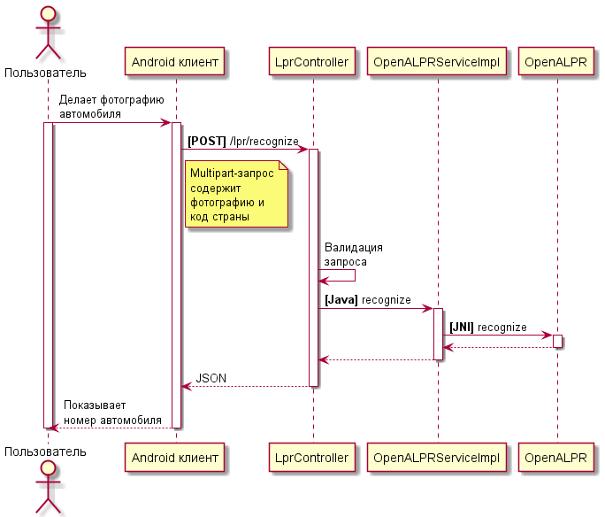

License plate recognition server
================================

Реализация серверной части проекта по распознаванию регистрационных знаков транспортных средств, запечатленных
средствами мобильной съёмки.
В работе использован язык программирования Java и популярный в веб-разработке фреймворк Spring.
Главной функцией сервера является предоставление REST службы, которая принимает в запросе изображение
автомобильного номера и возвращает распознанный на ней номер в текстовом формате, пригодном для обработки клиентской
программой.

Используемые технологи
----------------------
* Java - язык программирования общего назначения, версия 11
* [Maven](https://maven.apache.org) - широко используемая система сборки проектов, написанных на Java
* [Spring Boot](https://spring.io/projects/spring-boot) - используется в первую очередь как
  Inversion of Control-контейнер и MVC фреймворк
* [Lombok](https://projectlombok.org) - популярная библиотека для автоматического генерирования повторяющегося кода
  в Java классах
* [OpenALPR](https://github.com/openalpr/openalpr) - библиотека для распозавания автомобильных номеров и её *обёртки*
  для разных языков программирования (в то числе для Java), использует лицензию
  [AGPL-3.0 License](https://github.com/openalpr/openalpr/blob/master/LICENSE)
* [Logback](http://logback.qos.ch) - фреймворк логирования

Руководство
-----------
Для начала работы с проектом необходимо скопировать репозиторий на локальную машину:
```shell
git clone https://github.com/m19ivt1/license-plate-recognition-server.git
```
Так как библиотека *OpenALPR* написана на языке программирования *C++*, для запуска сервера
необходимо загрузить в корневую папку проекта файлы библиотеки, скомпилированные под конкретную платформу.
*Windows* версии библиотеки можно [загрузить](https://github.com/openalpr/openalpr/releases) с официального
репозитория проекта. Имеются 32 и 64-битные версии бинарных файлов.
Из скачанного zip-архива необходимо скопировать файлы **openalpr.dll**, **openalprjni.dll**, **liblept170.dll** и
**opencv_world300.dll** в папку проекта **license-plate-recognition-server**.

Помимо *.dll* файлов в корневую директорию необходимо скопировать папку **runtime_data** и файл
**openalpr.conf**. Они содержат конфигурационные данные, необходимые для корректной работы *OpenALPR*.

После подготовительных этапов можно скомпилировать проект.

Windows:
```shell
.\mvnw.cmd package
```

Linux:
```shell
./mvnw package
```

Результатом сборки будет файл **lprserver-1.0.0.jar** в папке **target**. Чтобы запустить его, выполните команду:
```shell
java -jar target/lprserver-1.0.0.jar
```
Запущенный сервер будет использовать по-умолчанию порт **8090** (можно изменить в **resources/application.properties**).

Документация REST службы
------------------------
* **URL**  
  /lpr/recognize
* **Метод:**  
  POST
* **Multipart параметры:**  
  license_plate_image - изображение (обязательный атрибут)  
  country_code - ["us", "eu"], код страны (обязательный атрибут)
* **Успешный ответ:**
  * **Код:** 200  
    **Тело ответа:**
    ```json
    {
      "number": "THECAR",
      "confidence": 92.18991
    }
    ```
* **Ошибки:**
  * **Код:** 400 - неправильный запрос от клиента
  * **Код:** 404 - автомобильный номер не был найден на фотографии
  * **Код:** 500 - ошибка на стороне сервера
* **Пример вызова службы:**  
  ```shell
  curl -i -F "license_plate_image=@<path_to_image>" -F "country_code=us" <host_address>:8090/lpr/recognize
  ```

Логирование
-----------
Для того, чтобы администратор сервера всегда имел актуальное представление того, что происходит в работе приложения,
в код проекта было добавлено логирование. Реализовано при помощи библиотеки [Logback](http://logback.qos.ch).
Логирование происходит на всех основных этапах обработки пользовательского запроса. Благодаря этому каждый, кто имеет
доступ к серверу, может проследить запрос, его результат и возможную причину ошибки.

Логи записываются как непосредственно в консоль, так и в файл `<server_root>/logs/server.log`.
По наступлению полночи или достижению размера в 10 MB, файл переименовывается и запись происходит в новый `server.log`.
Таким образом упрощается поиск логов по дате.

Структура проекта
-------------------
Код Java модуля поделён на пакеты, каждый из которых имеет свою функцию.

### ru.nntu.lprserver
Корневой пакет.
#### LprServerApplication
Основной класс программы, инициализирует и запускает сервер.

### ru.nntu.lprserver.configuration
Пакет для `@Configuration` классов.
#### WebConfiguration
Конфигурационный класс, единственным предназначением которого является настройка бин-объекта
**CommonsMultipartResolver** (служит для обработки *HTTP multipart*-запросов).

### ru.nntu.lprserver.controller
#### LprController
Контроллер, реализует REST службу для распознавания автомобильного номерного знака.
Метод `recognize` обрабатывает POST запросы по адресу `/lpr/recognize`. Принимает *multipart*-запрос с изображением
(атрибут **license_plate_image**) и код страны (атрибут **countryCode**).
Главной задачей контроллера является обработка HTTP запроса, его валидация, делегирование задачи
сервису `LprService` и возврат HTTP ответа.

### ru.nntu.lprserver.controller.dto
#### LprResponseDto
[DTO](https://ru.wikipedia.org/wiki/DTO) - объект для передачи HTTP ответа клиенту. Автоматически конвертируется
в JSON-объект.

### ru.nntu.lprserver.service
#### LprService
Интерфейс, декларирующий метод(ы) для работы со службой по распознаванию автомобильного номерного знака:
```java
Optional<LprResult> recognize(byte[] imageData, SupportedCountry country);
```
В качестве атрибутов принимает изображение в виде байт-массива и страну, к которой относится номерной знак
(перечисление `SupportedCountry`). На данный момент поддерживаются США и страны Европейского союза.

### ru.nntu.lprserver.service.impl
Здесь расположены реализации интерфейса `ru.nntu.lprserver.service.LprService`. На сегодняшний момент имеется
единственный класс, который реализует этот интерфейс.
#### OpenALPRServiceImpl
Как видно из названия, данная реализация `LprService` использует библиотеку *OpenALPR*. За основу взят пример из
документации библиотеки: http://doc.openalpr.com/bindings.html#java.

### ru.nntu.lprserver.model
Содержит классы, которые описывают объекты, относящиеся к общему "домену" решаемой проблемы. Не имеет зависимостей от
конкретных технологий, используемых в проекте.

Диаграмма последовательности
----------------------------


Результаты работы с OpenALPR
----------------------------
Проблема компьютерного зрения и распознавания сама по себе является непростой задачей, решение которой
занимает большое количество ресурсов и времени. Благодаря OpenALPR, обязанности разработчика по большей части сводятся
к интеграции сервера и кода библиотеки. OpenALPR использует технологии [OpenCV](https://en.wikipedia.org/wiki/OpenCV)
и [Tesseract](https://en.wikipedia.org/wiki/Tesseract_(software)).

Что касается результатов и точности работы, OpenALPR справляется на неплохом уровне. Тем не менее оставляет простор
для улучшений и доработок. Также библиотека поддерживает ограниченный набор стран, номера которых способна
распознавать. Однако, OpenALPR позволяет настраивать конфигурацию таким образом, чтобы сторонний разработчик
мог добавлять и другие страны. В рамках реализации данного проекта, были выбраны США и страны Европейского союза.